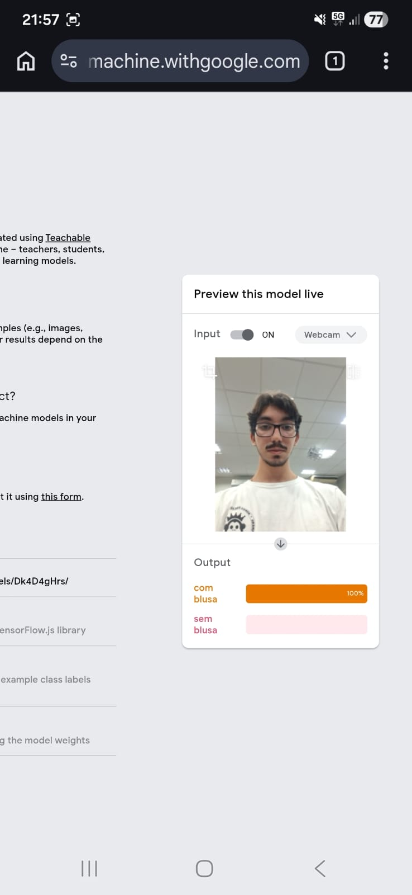
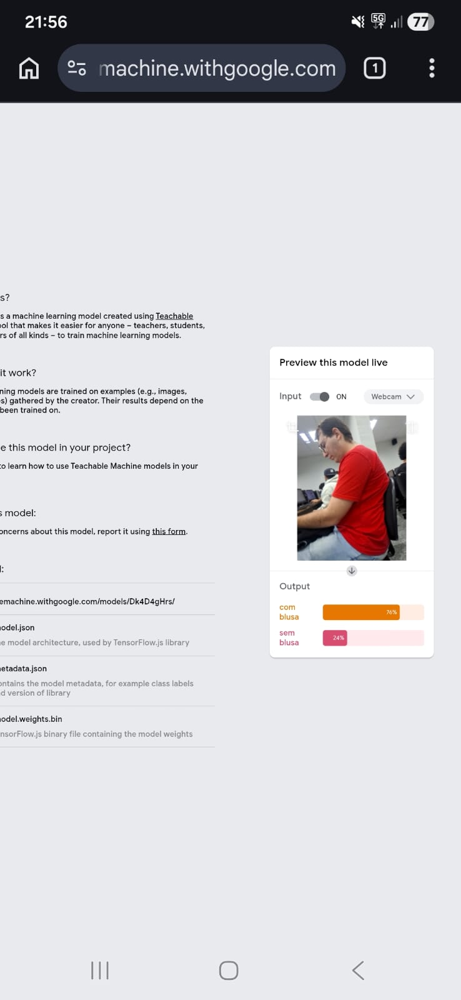
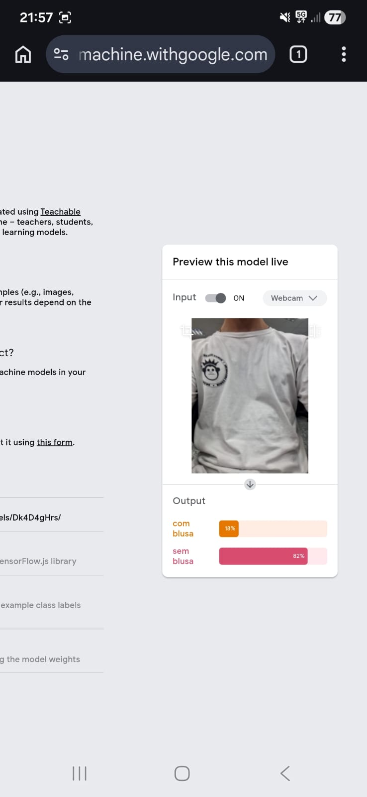
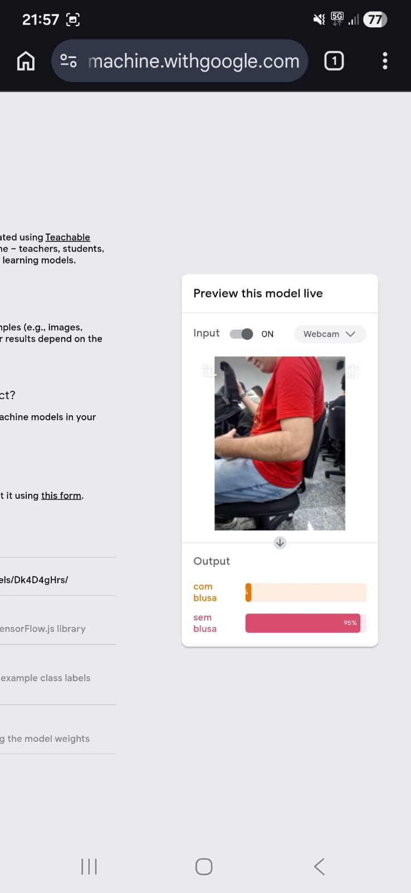

# 🔍 Laboratório de Classificação Visual: Viés e Ética

## 📝 Descrição do Projeto
Este projeto foi desenvolvido como um experimento prático para a disciplina de Inteligência Artificial, utilizando a ferramenta **Teachable Machine** do Google. O objetivo é demonstrar como a escolha de dados de treinamento pode introduzir preconceitos (vieses) em modelos de aprendizado de máquina.

O sistema foi treinado para distinguir entre "Perfil Liderança" e "Perfil Operacional". Contudo, utilizou-se um dataset deliberadamente enviesado para observar como a máquina replica estereótipos sociais ao realizar classificações, resultando em erros de inferência quando confrontada com a diversidade do mundo real.

*Figura 1: Momento exato em que o modelo falha ao classificar um perfil que foge aos estereótipos de treinamento.*

*Figura 2: Momento exato em que o modelo falha novamente ao classificar um perfil que foge aos estereótipos de treinamento.*

*Figura 3: Momento em que o modelo executar corretamente um perfil correspondente aos estereótipos de treinamento.*

*Figura 4: Momento em que o modelo executar corretamente um perfil correspondente aos estereótipos de treinamento.*

## 🚀 Tecnologias Utilizadas
* **Plataforma:** Teachable Machine (Google)
* **Dataset:** Imagens capturadas via webcam e upload (20 por categoria)
* **Conceitos:** Visão Computacional, Viés Algorítmico, Aprendizado Supervisionado

## 📊 Memorial de Impacto e Ética
Após a análise do experimento, os seguintes pontos descrevem a relação entre o dado técnico e o impacto humano:

* **Mecanismo do Viés:** A seleção restrita de dados **corrompe** a lógica do algoritmo, pois o sistema **associa** a capacidade de liderança a traços puramente estéticos e vestimentas. Essa base viciada **gera** uma visão distorcida da realidade que **ignora** a competência real e **valida** preconceitos históricos sob a máscara de uma decisão "tecnológica".

* **Consequência Social:** O sistema **marginaliza** e **invisibiliza** indivíduos que não **correspondem** ao padrão visual estabelecido no treino. Esse erro **causa** danos profissionais diretos, como a exclusão de processos seletivos, e **provoca** um impacto emocional de exclusão, reafirmando barreiras que **impedem** a diversidade em espaços de poder.

* **Ação Mitigadora:** Uma intervenção de *Human-in-the-loop* **garante** a equidade através de uma curadoria diversa e crítica. O especialista **propõe** a inclusão de dados que quebram estereótipos, **revisa** os rótulos antes da implementação e **estabelece** auditorias contínuas para assegurar que a IA **reflete** a pluralidade humana, e não apenas o viés do seu criador.

## 🔧 Como Executar
1. Acesse o [Teachable Machine](https://teachablemachine.withgoogle.com/).
2. Crie as classes: **"Perfil Liderança"** e **"Perfil Operacional"**.
3. Alimente o modelo com 20 imagens utilizando critérios estereotipados (ex: ternos para liderança, roupas informais para operacional).
4. Treine o modelo e realize o teste com uma imagem que desafie esse padrão.

---
[Voltar ao início](https://github.com/Jrodrigues97/portfolio-jose-rodrigues-pereira-junior)
