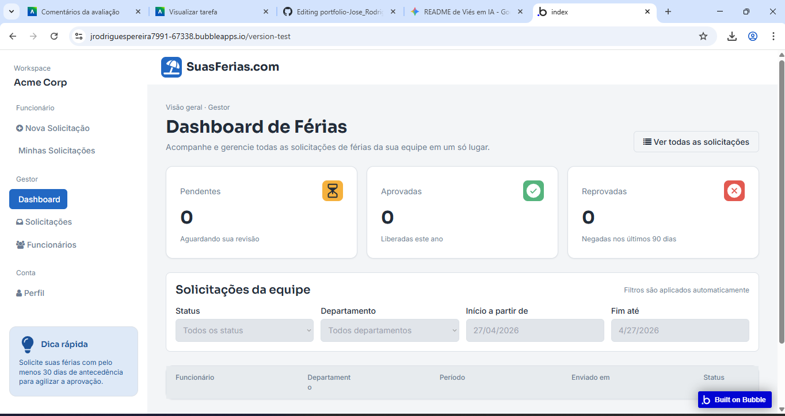

# 🚀 Gestão Inteligente com Bubble: IA + Engenharia de Software

## 📝 Descrição do Projeto
Este projeto consiste em uma aplicação web de gestão (Gerenciador de Orçamentos/Férias) desenvolvida na plataforma **Bubble.io**. O diferencial desta aplicação é a utilização da Inteligência Artificial do Bubble como acelerador de rascunho, seguida de uma rigorosa camada de **Engenharia de Software** humana.

O objetivo principal é mitigar as falhas comuns de IAs generativas de código, como lógicas de permissão inexistentes e falta de escalabilidade. Aplicamos fundamentos de **Privacy by Design**, governança de dados e otimização de infraestrutura para garantir que o sistema não seja apenas funcional, mas seguro e profissional.

*Figura 1: Interface principal da aplicação refatorada após a geração inicial por IA.*

## 🚀 Tecnologias e Boas Práticas
* **Plataforma No-Code:** Bubble.io (Versão 2024/2026)
* **Modelagem de Dados:** Mapeamento de Entidades, Otimização de Relações e Option Sets (Anti-hardcode).
* **Segurança:** Regras de Privacidade estritas (OWASP Top 10 para LCNC).
* **Governança:** Organização de Workflows por cores e documentação in-platform (Notes).
* **Desempenho:** Otimização de Unidades de Carga de Trabalho (WUs) e buscas eficientes.

## 📊 Resultados e Aprendizados
O projeto demonstrou que a IA é uma excelente ferramenta de prototipagem, mas exige intervenção técnica para atingir maturidade produtiva.
* **Segurança Eficaz:** Implementação de regras de privacidade onde 100% dos dados são isolados por criador (Creator is Current User).
* **Escalabilidade:** Substituição de listas pesadas por relações otimizadas entre tabelas.
* **Governança:** Redução de dívida técnica através de workflows comentados e organizados cromaticamente.

*Figura 2: Configuração das regras de privacidade para proteção contra vazamento de dados.*

## 🔧 Como Executar
1. Acesse o aplicativo através do [Link da Versão de Teste](https://jrodriguespereira7991-67338.bubbleapps.io/version-test?debug_mode=true).
2. Realize o cadastro de um novo usuário.
3. Teste a criação de registros (orçamentos/pedidos).
4. Tente acessar dados de outro usuário (o sistema deve bloquear via Regras de Privacidade).

*Figura 3: Pipeline de automação com cores organizadas e notas explicativas.*

## 🛡️ Estratégia de Saída (Vendor Lock-in)
Como o Bubble retém a posse do código-fonte, a estratégia para mitigar o risco de *Vendor Lock-in* consiste em:
1.  **Habilitação da Data API:** Garantir que todos os dados possam ser extraídos em formato JSON.
2.  **Exportação via CSV/JSON:** Planejamento de migração de tabelas de Usuários e Registros para um banco de dados externo (PostgreSQL/Node.js) caso o sistema precise ser reescrito em código tradicional no futuro.

---
[Voltar ao início](https://github.com/Jrodrigues97/portfolio-jose-rodrigues-pereira-junior)
